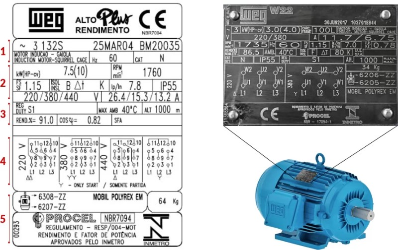

.

# Informações Gerais
- Modelo (3132S): Indica o modelo do motor.
- Data de Fabricação (25MAR04): Data em que o motor foi fabricado.
- Número de Série (BM20035): Número único de identificação do motor.

# Especificações Elétricas
- Tipo de Motor (MOTOR INDUÇÃO - GAIOLA): Indica que o motor é do tipo indução com rotor em gaiola.
- Frequência (Hz): A frequência de operação, que é 60 Hz.
- Potência (kW): A potência do motor é 7.5 kW, equivalente a 10 HP (Horsepower).
- Rotação (RPM/min): Velocidade de rotação, que é 1760 RPM.
- Fator de Serviço (SF): Fator de serviço de 1.15, que permite sobrecarga momentânea de 15%.
- Isolamento (ISOL INS): Classe de isolamento do motor, que é B.
- Corrente Nominal (I): Corrente nominal em diferentes tensões (220V, 380V, 440V): 26.4/15.3/13.2 A.
- Corrente de partida (Ip/In): Corrente de partida em relação à corrente nominal, que é 7.8.
- Grau de Proteção (IP55): O motor é protegido contra poeira e jatos de água.
- Tensões de Operação (V): Tensões nominais nas quais o motor pode operar (220/380/440V).

# Condições de Operação
- Regime de Trabalho (REG DUTY S1): Indica que o motor é projetado para operar em serviço contínuo.
- Rendimento (RENDT.%): Eficiência do motor, que é 91.0%.
- Fator de Potência (COS φ): Fator de potência, que é 0.82.
- Temperatura Máxima Ambiente (MAX AMB): Temperatura máxima ambiente de operação, que é 40°C.
- Altitude Máxima de Operação (ALT): Altitude máxima de operação, que é 1000 metros.

# Diagramas de Conexão
- Diagrama de Ligação 220V: Mostra como conectar o motor em 220V.
- Diagrama de Ligação 380V: Mostra como conectar o motor em 380V.
- Diagrama de Ligação 440V: Mostra como conectar o motor em 440V.
- Observação: Apenas para partida (only start / somente partida).

# Outras Informações
- Tipo de Rolamentos (6308-ZZ, 6207-ZZ): Indica os tipos de rolamentos usados no motor.
- Lubrificação (MOBIL POLYREX EM): Tipo de lubrificante utilizado.
- Peso (64 Kg): Peso total do motor.
- Certificações e Aprovações: Selo de eficiência energética (PROCEL) e normas atendidas (NBR7094, INMETRO).
